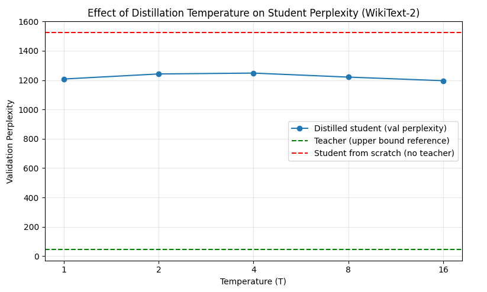
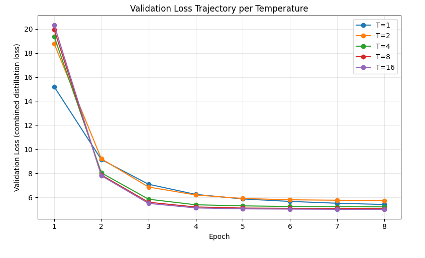

# Knowledge Distillation: Temperature Sweep Study

A from-scratch reproduction of Hinton, Vinyals & Dean's *"Distilling the Knowledge in a Neural Network"* (2015), extended to autoregressive language modeling — a domain the original paper did not cover (their experiments were on MNIST and an internal Google speech acoustic model, not CNNs or language models).

## Setup

- **Teacher:** GPT-2 small (124M params, 12 layers, d_model=768, 12 heads) — open-weight, so full next-token logits are accessible at every position.
- **Student:** custom transformer built on `nn.TransformerEncoderLayer` with causal masking, 12 layers, d_model=256, n_heads=4 (64 dims/head, matching GPT-2's convention), tied input/output embeddings, ~22.6M params.
- **Dataset:** WikiText-2, tokenized with GPT-2's own tokenizer, concatenated into a continuous stream and chunked into fixed-length (input, target) pairs shifted by one token.
- **Loss:** `alpha * T² * KL_loss + (1 - alpha) * CE_loss`, where `KL_loss` is KL-divergence between temperature-softened teacher and student distributions, and `CE_loss` is standard cross-entropy against true next-token labels. `alpha = 0.5` throughout. The `T²` term corrects for the ~`1/T²` gradient shrinkage that softening otherwise introduces, so different temperature runs stay comparable.
- **Temperature sweep:** T ∈ {1, 2, 4, 8, 16} — doubling spacing, since softmax-temperature flattening is nonlinear and changes fastest at low T.
- **Runs:** 5 distilled students (one per T) + 1 student trained from scratch (hard labels only, no teacher) + 1 teacher-eval baseline (GPT-2's own perplexity, upper-bound reference). Each temperature run uses a freshly initialized student and optimizer.
- **Metric:** validation perplexity (`exp(cross-entropy loss)`), computed via a separate pure-CE evaluation pass so the reported number is never contaminated by the combined training loss.

## A bug worth mentioning

`nn.KLDivLoss(reduction='batchmean')` only divides by the batch dimension, not batch×sequence-length. Since student and teacher logits here have shape `(batch, seq_len, vocab_size)`, this silently inflated the KL term by a factor of ~`seq_len` relative to the cross-entropy term, dominating the loss and corrupting early training (losses in the thousands instead of a sane ~10-15 starting point). Fixed by flattening both `(batch, seq_len, vocab_size)` tensors to `(batch*seq_len, vocab_size)` before calling `KLDivLoss`, matching how the CE term was already normalized.

## Results

**Final validation perplexity (8 epochs, converged):**

| Model              | Perplexity |
|--------------------|-----------:|
| Teacher (GPT-2)     | 44.4       |
| Student, T=1        | 1207.9     |
| Student, T=2        | 1242.3     |
| Student, T=4        | 1248.3     |
| Student, T=8        | 1220.9     |
| Student, T=16       | 1196.4     |
| Student, from scratch | 1526.1   |

## Findings

1. **Distillation helps, substantially.** Every distilled student outperforms the from-scratch baseline (1196–1248 vs. 1526 perplexity) — the teacher's soft targets are transferring real, useful signal beyond what the from-scratch student can pick up from hard labels alone.

2. **Temperature has a real but small, non-monotonic effect.** Across the sweep, perplexity traces a hump shape — best at the extremes (T=1: 1207.9, T=16: 1196.4), worst in the middle (T=4: 1248.3) — not the clean "higher T monotonically helps up to a point, then degrades" story a simple reading of the paper might suggest. The full spread across all five temperatures is only ~4%, which is small enough that it could partly reflect single-run noise rather than a robust trend (see limitations).

3. **A large capacity gap remains.** Even the best distilled student (T=16) is roughly 27x worse in perplexity than the teacher. At ~22.6M params against GPT-2's 124M, this is plausibly a genuine capacity ceiling rather than a training or distillation-quality issue — the student may simply be too small to represent what a 124M-parameter model has learned, regardless of how good the training signal is.

## Limitations

- Each temperature was trained with a **single run** (single seed) — the sweep results are suggestive, not statistically robust. The ~4% spread between best and worst T could partly be run-to-run variance rather than a true temperature effect.
- `alpha` was fixed at 0.5 and not itself swept.
- Training was run for 8 epochs, chosen because validation loss visibly flattened across all five temperatures by that point (see the trajectory plot) — but this is a practical stopping point, not a guarantee of full convergence.
- The temperature range (1–16) never showed the expected "too much softening destroys the signal" degradation described in the original paper — perplexity was still slightly improving at T=16, suggesting the useful range may extend further for this setup.

## Possible extensions

- Repeat each temperature with multiple seeds to separate real trend from noise.
- Sweep `alpha` independently of `T`.
- Extend the temperature range beyond 16 to look for the degradation the paper describes.
- Vary student capacity (fewer/more layers) to see whether the temperature effect becomes more pronounced with a more capacity-constrained student.

## Project history

Previous projects in this self-directed systems → deep learning track: a custom memory allocator (C), a CHIP-8 emulator (C), a scalar-valued autograd engine (reverse-mode backprop, from scratch), and a from-scratch LoRA reproduction on GPT-2 with a full rank ablation study (r=2 to r=64).
